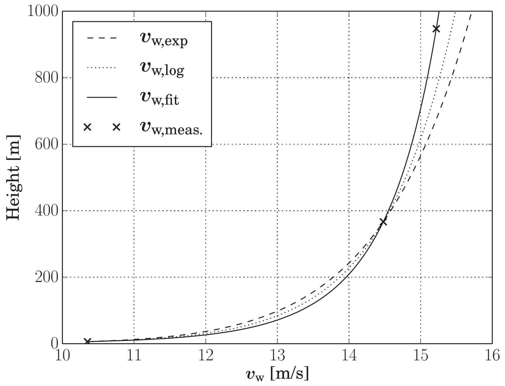

# AtmosphericModels

## Exported types
```julia
AtmosphericModel
@enum ProfileLaw EXP=1 LOG=2 EXPLOG=3 FAST_EXP=4 FAST_LOG=5 FAST_EXPLOG=6
```

## Exported functions
```julia
calc_rho(s::AM, height)
calc_wind_factor(s::AM, height, ::Type{Val{1}})
calc_wind_factor(s::AM, height, ::Type{Val{2}})
calc_wind_factor(s::AM, height, ::Type{Val{3}})
calc_wind_factor(s::AM, height, ::Type{Val{4}})
calc_wind_factor(s::AM, height, ::Type{Val{5}})
calc_wind_factor(s::AM, height, ::Type{Val{6}})
```
## Wind profile

<p align="center"></p>

The EXPLOG profile law is the fitted linear combination of the exponentional and the log law.

## Usage
```julia
using AtmosphericModels
am = AtmosphericModel()

const profile_law = Int(EXPLOG)
height = 100.0
wf = calc_wind_factor(am, height, Val{profile_law})
```
The result is the factor with which the ground wind speed needs to be mulitplied
to get the wind speed at the given height.

## Plot a wind profile
```julia
using AtmosphericModels, Plots
am = AtmosphericModel()

heights = 6:1000
wf = [calc_wind_factor(am, height, Val{Int(EXPLOG)}) for height in heights]

plot(heights, wf, legend=false, xlabel="height [m]", ylabel="wind factor")
```

## Benchmark
```julia
using AtmosphericModels, BenchmarkTools

am = AtmosphericModel()
@benchmark calc_wind_factor(am, height, Val{Int(EXPLOG)}) setup=(height=Float64((6.0+rand()*500.0)))
```
|Profile law|time [ns]|
| ---    |:---:|
|EXP     |17   |
|LOG     |16   |
|EXPLOG  |33   |
|FAST_EXP|6.6  |
|FAST_LOG|6.6  |
|FAST_EXPLOG|6.6|

The FAST versions are an approximations with an error of less than $1.5 \cdot 10^{-5}$ and are correct only for the default values of h_ref, z0 and alpha.  

## See also
- [Research Fechner](https://research.tudelft.nl/en/publications/?search=Uwe+Fechner&pageSize=50&ordering=rating&descending=true)
- The application [KiteViewer](https://github.com/ufechner7/KiteViewer)
- the package [KiteUtils](https://github.com/ufechner7/KiteUtils.jl)
- the package [KitePodModels](https://github.com/aenarete/KitePodModels.jl)
- the package [KiteModels](https://github.com/ufechner7/KiteModels.jl)
- the package [KiteControllers](https://github.com/aenarete/KiteControllers.jl)
- the package [KiteViewers](https://github.com/aenarete/KiteViewers.jl)

